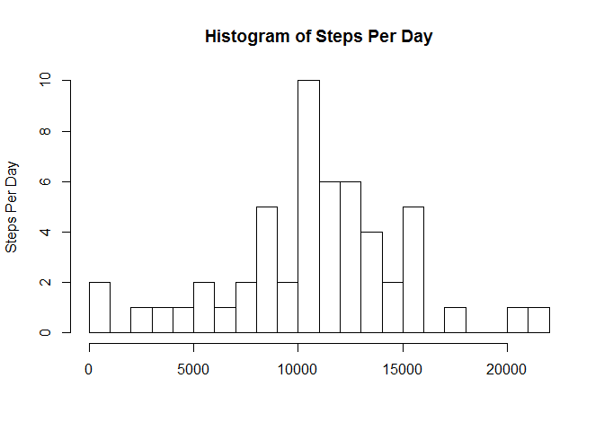
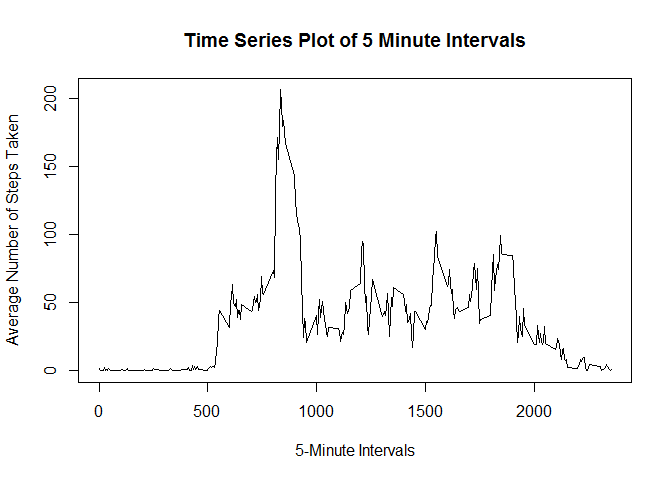
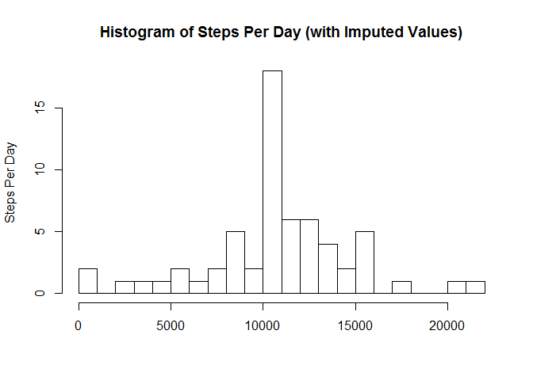
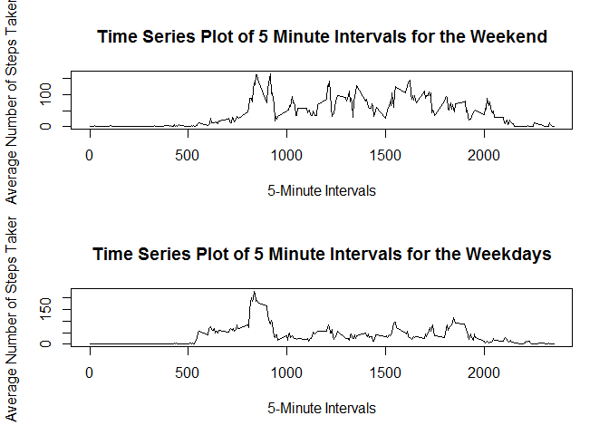

# Reproducible Research: Peer Assessment 1


## Loading and preprocessing the data


```r
data <- read.csv("activity.csv")
complete <- data[complete.cases(data), ]
```


## What is mean total number of steps taken per day?


```r
complete.sum <- tapply(complete$steps,complete$date,sum)
hist(complete.sum, breaks = 20, ylab = "Steps Per Day", xlab = "", main = "Histogram of Steps Per Day")
```

 

```r
complete.mean <- mean(complete.sum[complete.cases(complete.sum)])  
#tapply(complete$steps,complete$date,mean)
paste("The mean is:",complete.mean, sep = " ")
```

```
## [1] "The mean is: 10766.1886792453"
```

```r
complete.median <- median(complete.sum[complete.cases(complete.sum)])
#tapply(complete$steps,complete$date,median)
paste("The median is:", complete.median, sep = " ")
```

```
## [1] "The median is: 10765"
```


## What is the average daily activity pattern?


```r
time.series <- tapply(complete$steps,complete$interval,mean)
plot(y=time.series,x=row.names(time.series), type = 'l', xlab = "5-Minute Intervals", ylab ="Average Number of Steps Taken", main ="Time Series Plot of 5 Minute Intervals")
```

 

```r
max <- which.max(time.series)
paste("The 5 minute interval with the maximum average of steps on all days is:", names(max), sep = " ")
```

```
## [1] "The 5 minute interval with the maximum average of steps on all days is: 835"
```


## Imputing missing values


```r
paste("The total number of missing values is:",sum(is.na(data)),sep=" ")
```

```
## [1] "The total number of missing values is: 2304"
```

```r
newdata <- data
for (i in 1:nrow(newdata)) {
    if (is.na(newdata$steps[i])) {
        newdata$steps[i] <- time.series[which(newdata$interval[i] == row.names(time.series))]
    }
}
new.sum <- tapply(newdata$steps,newdata$date,sum)
hist(new.sum, breaks = 20, ylab = "Steps Per Day", xlab = "", main = "Histogram of Steps Per Day (with Imputed Values)")
```

 

```r
new.mean <- mean(new.sum)
paste("The mean of the imputed data is:",new.mean, sep = " ")
```

```
## [1] "The mean of the imputed data is: 10766.1886792453"
```

```r
new.median <- median(new.sum)
paste("The median of the imputed data is:", new.median, sep = " ")
```

```
## [1] "The median of the imputed data is: 10766.1886792453"
```

```r
paste("The difference in the means are:", abs(new.mean-complete.mean), sep = " ")
```

```
## [1] "The difference in the means are: 0"
```

```r
paste("The difference in the medians are:", abs(new.median-complete.median), sep = " ")
```

```
## [1] "The difference in the medians are: 1.1886792452824"
```

## Are there differences in activity patterns between weekdays and weekends?


```r
newdata$weekdays <- ifelse(as.POSIXlt(newdata$date)$wday %in% c(0,6), 'weekend', 'weekday')
averagednewdata <- aggregate(steps ~ interval + weekdays, data=newdata, mean)
averagednewdataWeekend <- subset(averagednewdata, weekdays == "weekend")
averagednewdataWeekday <- subset(averagednewdata, weekdays == "weekday")
par(mfrow=c(2,1))
plot(y=averagednewdataWeekend$steps,x=averagednewdataWeekend$interval, type = 'l', xlab = "5-Minute Intervals", ylab ="Average Number of Steps Taken", main ="Time Series Plot of 5 Minute Intervals for the Weekend")
plot(y=averagednewdataWeekday$steps,x=averagednewdataWeekday$interval, type = 'l', xlab = "5-Minute Intervals", ylab ="Average Number of Steps Taken", main ="Time Series Plot of 5 Minute Intervals for the Weekdays")
```

 
