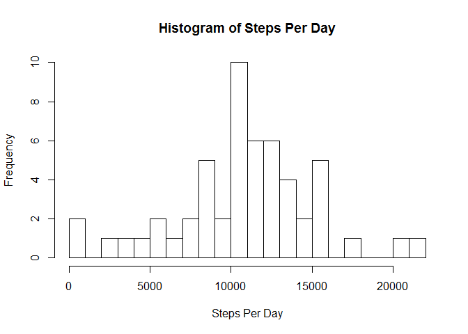
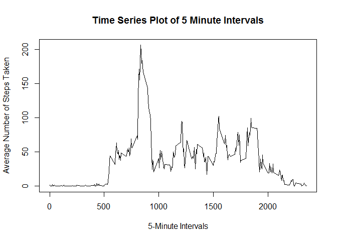
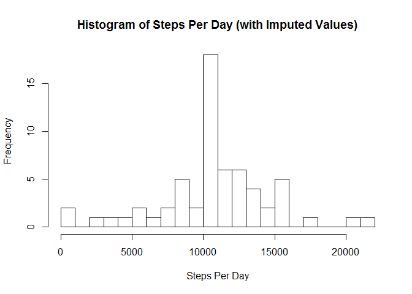
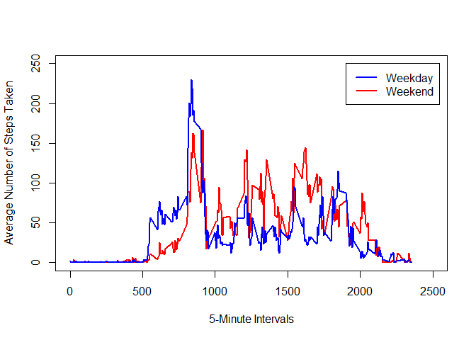

# Personal Tracking Analysis - Insight Demo

## Loading and preprocessing the data


```r
data <- read.csv("activity.csv")
head(data, 15)
```

```
##    steps       date interval
## 1     NA 2012-10-01        0
## 2     NA 2012-10-01        5
## 3     NA 2012-10-01       10
## 4     NA 2012-10-01       15
## 5     NA 2012-10-01       20
## 6     NA 2012-10-01       25
## 7     NA 2012-10-01       30
## 8     NA 2012-10-01       35
## 9     NA 2012-10-01       40
## 10    NA 2012-10-01       45
## 11    NA 2012-10-01       50
## 12    NA 2012-10-01       55
## 13    NA 2012-10-01      100
## 14    NA 2012-10-01      105
## 15    NA 2012-10-01      110
```

```r
str(data)
```

```
## 'data.frame':	17568 obs. of  3 variables:
##  $ steps   : int  NA NA NA NA NA NA NA NA NA NA ...
##  $ date    : Factor w/ 61 levels "2012-10-01","2012-10-02",..: 1 1 1 1 1 1 1 1 1 1 ...
##  $ interval: int  0 5 10 15 20 25 30 35 40 45 ...
```

```r
summary(data)
```

```
##      steps                date          interval     
##  Min.   :  0.00   2012-10-01:  288   Min.   :   0.0  
##  1st Qu.:  0.00   2012-10-02:  288   1st Qu.: 588.8  
##  Median :  0.00   2012-10-03:  288   Median :1177.5  
##  Mean   : 37.38   2012-10-04:  288   Mean   :1177.5  
##  3rd Qu.: 12.00   2012-10-05:  288   3rd Qu.:1766.2  
##  Max.   :806.00   2012-10-06:  288   Max.   :2355.0  
##  NA's   :2304     (Other)   :15840
```

```r
complete <- data[complete.cases(data), ]
head(complete, 15)
```

```
##     steps       date interval
## 289     0 2012-10-02        0
## 290     0 2012-10-02        5
## 291     0 2012-10-02       10
## 292     0 2012-10-02       15
## 293     0 2012-10-02       20
## 294     0 2012-10-02       25
## 295     0 2012-10-02       30
## 296     0 2012-10-02       35
## 297     0 2012-10-02       40
## 298     0 2012-10-02       45
## 299     0 2012-10-02       50
## 300     0 2012-10-02       55
## 301     0 2012-10-02      100
## 302     0 2012-10-02      105
## 303     0 2012-10-02      110
```

```r
str(complete)
```

```
## 'data.frame':	15264 obs. of  3 variables:
##  $ steps   : int  0 0 0 0 0 0 0 0 0 0 ...
##  $ date    : Factor w/ 61 levels "2012-10-01","2012-10-02",..: 2 2 2 2 2 2 2 2 2 2 ...
##  $ interval: int  0 5 10 15 20 25 30 35 40 45 ...
```

```r
summary(complete)
```

```
##      steps                date          interval     
##  Min.   :  0.00   2012-10-02:  288   Min.   :   0.0  
##  1st Qu.:  0.00   2012-10-03:  288   1st Qu.: 588.8  
##  Median :  0.00   2012-10-04:  288   Median :1177.5  
##  Mean   : 37.38   2012-10-05:  288   Mean   :1177.5  
##  3rd Qu.: 12.00   2012-10-06:  288   3rd Qu.:1766.2  
##  Max.   :806.00   2012-10-07:  288   Max.   :2355.0  
##                   (Other)   :13536
```

## Average number of steps taken per day


```r
complete.sum <- tapply(complete$steps,complete$date,sum)
hist(complete.sum, breaks = 20, ylab = "Frequency", xlab = "Steps Per Day", main = "Histogram of Steps Per Day")
```

 

```r
complete.mean <- mean(complete.sum[complete.cases(complete.sum)])  
```
The mean is: 

```
## [1] 10766.19
```


```r
complete.median <- median(complete.sum[complete.cases(complete.sum)])
```
The median is: 

```
## [1] 10765
```

## Average Daily Activity Pattern


```r
time.series <- tapply(complete$steps,complete$interval,mean)
plot(y=time.series,x=row.names(time.series), type = 'l', xlab = "5-Minute Intervals", ylab ="Average Number of Steps Taken", main ="Time Series Plot of 5 Minute Intervals")
```

 

```r
max <- which.max(time.series)
```
The 5 minute interval with the maximum average of steps on all days is:

```
## [1] "835"
```

## Imputing missing values

The total number of missing values is: 

```r
sum(is.na(data))
```

```
## [1] 2304
```


```r
newdata <- data
for (i in 1:nrow(newdata)) {
    if (is.na(newdata$steps[i])) {
        newdata$steps[i] <- time.series[which(newdata$interval[i] == row.names(time.series))]
    }
}
new.sum <- tapply(newdata$steps,newdata$date,sum)
hist(new.sum, breaks = 20, ylab = "Frequency", xlab = "Steps Per Day", main = "Histogram of Steps Per Day (with Imputed Values)")
```

 

```r
new.mean <- mean(new.sum)
```

The mean of the imputed data is: 

```
## [1] 10766.19
```


```r
new.median <- median(new.sum)
```

The median of the imputed data is:

```
## [1] 10766.19
```
The difference in the means are:

```
## [1] 0
```
The difference in the medians are:

```
## [1] 1.188679
```

## Weekdays vs. Weekends


```r
newdata$weekdays <- ifelse(as.POSIXlt(newdata$date)$wday %in% c(0,6), 'weekend', 'weekday')
averagednewdata <- aggregate(steps ~ interval + weekdays, data=newdata, mean)
averagednewdataWeekend <- subset(averagednewdata, weekdays == "weekend")
averagednewdataWeekday <- subset(averagednewdata, weekdays == "weekday")
```


```r
linewidth <- 2

plot(c(0,2500),c(0,250),type= 'n', xlab= "5-Minute Intervals", ylab = "Average Number of Steps Taken")
lines(x = averagednewdataWeekend$interval, y = averagednewdataWeekend$steps,col="red",lwd=linewidth) 
lines(x = averagednewdataWeekday$interval, y = averagednewdataWeekday$steps,col="blue",lwd=linewidth) 
legend(1900, 250, c("Weekday", "Weekend"), lty=c(1,1), lwd=c(linewidth,linewidth), col=c("blue","red")) 
```

 

```r
summary(averagednewdataWeekend$steps)
```

```
##    Min. 1st Qu.  Median    Mean 3rd Qu.    Max. 
##   0.000   1.241  32.340  42.370  74.650 166.600
```

```r
summary(averagednewdataWeekday$steps)
```

```
##    Min. 1st Qu.  Median    Mean 3rd Qu.    Max. 
##   0.000   2.247  25.800  35.610  50.850 230.400
```
